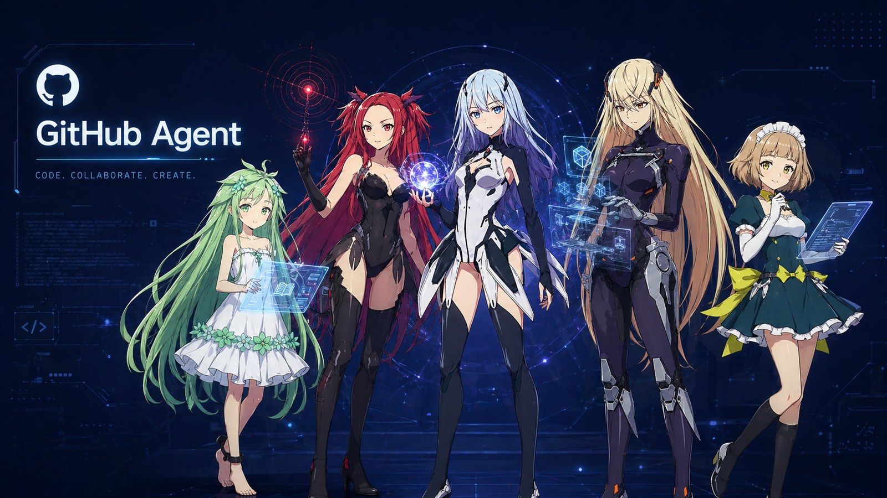

<p align="center">
  
</p>

<h1 align="center">Beatless — Hermes Constellation</h1>

<p align="center">
  <em>CODE · COLLABORATE · CREATE</em>
</p>

<p align="center">
  
  
  
  
  
</p>

---

> *"AI is not a tool — it is a mirror." — Beatless*

**Beatless** is the standards & control repository for an autonomous research-and-engineering OS,
themed after the 2018 anime *Beatless* and built on top of [Hermes Agent](https://github.com/nousresearch/hermes-agent).
Five hIE (humanoid Interface Element) personas drive five categories of cron-scheduled work,
from PR pipeline submission to paper-friction extraction to blog drafting — all autonomous,
all with kill-switches.

---

## ✦ The Five hIE — character ↔ cron mapping

<div align="center">

| hIE | Visual | Role in Hermes | What it ships |
|:---:|:---|:---:|:---|
| 🌸 **Snowdrop** | green-haired, holographic book | `paper-spotlight` | Deep reads of breakthrough papers; paradigm-friction extraction (Kimi K2.6) |
| ⚡ **Kouka** | red-haired, glowing red orb | `signal` | Time-sensitive news, model launches, product announcements |
| 📜 **Lacia** | silver-haired, central, blue contract orb | `bundle` | Cross-topic digests, weekly summaries, the orchestrator's voice |
| 🔧 **Methode** | blonde tactical, holographic shield | `engineering` | Tooling, framework dives, infrastructure deep-reads |
| 🛡️ **Saturnus** | maid silhouette, audit tablet | `audit` | System audits, regulation compliance, daily-evolution reports |

</div>

---

## ✦ Architecture (Constellation v3+)

```
                    ┌─────────────────────────────────────┐
                    │   Hermes Agent (Kimi K2.6 brain)    │
                    │   14 cron jobs · 6-engine routing   │
                    └─────────────────────────────────────┘
                                     │
        ┌────────────────────────────┼────────────────────────────┐
        ↓                            ↓                            ↓
   ┌─────────┐                 ┌──────────┐                 ┌──────────┐
   │  hIE    │                 │ Standards│                 │  Outputs │
   │ Cron    │                 │ (this    │                 │          │
   │ Jobs    │                 │  repo)   │                 │          │
   ├─────────┤                 ├──────────┤                 ├──────────┤
   │Snowdrop │ ← paper-extract │Repos.md  │ ← which repos   │Blog posts│
   │Kouka    │ ← signal        │Regulat.. │ ← red lines     │PRs       │
   │Lacia    │ ← bundle        │Skills/   │ ← agent specs   │Audits    │
   │Methode  │ ← engineering   │Pipelines/│ ← workflows     │Friction  │
   │Saturnus │ ← audit         │Commands/ │ ← slash cmds    │  yamls   │
   └─────────┘                 └──────────┘                 └──────────┘
```

---

## ✦ 6-Engine Roster (heterogeneous-by-design)

| Engine | Role | Strength | Where used |
|:---|:---|:---|:---|
| **Sonnet 4.6** | Mainhand orchestrator | Speed + reasoning | Most cron prompts |
| **Opus 4.7** | Idea + regulation generator | Depth | Decompose / plan writing |
| **Codex GPT-5.4** | Code review, faithfulness | Surgical edits | Devil's Advocate, novelty audit |
| **Codex GPT-5.3** | Debug rescue | Recovery | After 2 failed Sonnet rounds |
| **Gemini 3 Pro** | Wide-context research | Breadth | Decompose first-principles |
| **Kimi K2.6** | Tool-calling, friction extract | Cost-efficient | Friction Extract cron |
| **MiniMax M2.7** | Writing, translation | Style | Blog Translate (with Codex+Gemini review chain) |

**Heterogeneity rule** (Regulation §R2): writer ≠ reviewer. Never let the same model family
write and audit the same artifact.

---

## ✦ Live numbers (last 7 days)

<div align="center">

| Metric | Value |
|:---:|:---:|
| Open-source PRs created | **34** |
| Merged | **10** |
| Acceptance rate (finalized) | **41.5%** |
| Repos touched | **53** across Python · Rust · Go · TS |
| Blog posts auto-drafted | bilingual EN/ZH with Codex faithfulness + Gemini fluency review |
| Friction yamls produced | Kimi K2.6, 1 paper / 10 min · 144 papers/day cap |

</div>

---

## ✦ Repository layout

```
Beatless/
├── standards/      ← Repos.md · Regulations.md · Skills.md (canonical rules)
├── skills/         ← per-cron skill specs (blog-translate, github-pr, friction-extract, …)
├── pipelines/      ← multi-step workflows (research-loop, blog-pipeline)
├── commands/       ← Claude Code slash commands (/research-* family)
├── agents/         ← agent definitions
├── plan/           ← planning docs (rule-library-architecture, blog-taxonomy-hIE, …)
├── docs/           ← cross-cutting documentation
└── ops/            ← operational runbooks
```

---

## ✦ Reading order (if you want to grok this system)

1. `standards/Regulations.md` — three core principles (red lines)
2. `standards/Repos.md` — convergence flow for repo selection
3. `plan/blog-taxonomy-hIE.md` — what each hIE means + image conventions
4. `skills/cron-jobs/` — concrete examples of how a single cron tick works
5. The [Profile README](https://github.com/CrepuscularIRIS) — the human-facing summary

---

<p align="center">
  <sub>An autonomous constellation. A maid (Saturnus) at the audit desk. A pact (Lacia) at the center.<br/>
  Five characters from a 2018 anime, doing real engineering — every hour, every commit.</sub>
</p>
