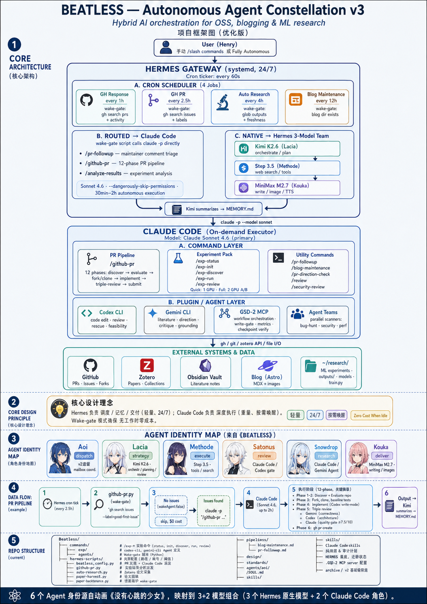

# Beatless

Autonomous agent orchestration for open-source contribution, technical writing, and ML research.

Beatless is a hybrid control plane: a lightweight scheduler watches for useful work, then routes deep execution to Claude Code, Codex, Gemini, GitHub, Zotero, and local experiment workspaces.



## What It Does

| Area | Purpose |
| --- | --- |
| GitHub response | Watch open PRs and surface maintainer comments that need action. |
| GitHub PR pipeline | Discover issues, evaluate repositories, implement fixes, review, and prepare PRs. |
| Research automation | Resume or halt experiment workspaces based on recorded state. |
| Paper workflow | Harvest papers, deduplicate against Zotero, and sync metadata into notes. |
| Dashboard | Show agents, pipelines, experiment status, GPU state, and recent activity. |
| CLI bridges | Route Claude Code agents through local Codex and Gemini CLIs. |

## Architecture

Beatless separates scheduling from execution.

- Hermes handles cron, wake gates, lightweight status checks, and routing.
- Claude Code handles long-running reasoning and command execution.
- Codex focuses on code edits, feasibility checks, and review.
- Gemini focuses on literature grounding, large-context review, and critique.
- Zotero and Obsidian hold research inputs and reading outputs.
- The dashboard reads JSON state from local collectors and renders it through a decoupled frontend.

## Repository Layout

| Module | Description |
| --- | --- |
| `commands/exp` | Slash commands for experiment status, init, discovery, run, and review. |
| `commands/agents` | Claude Code agent wrappers for Codex CLI and Gemini CLI. |
| `hermes-scripts` | Wake-gate scripts for GitHub, Zotero, research, blog, and preflight checks. |
| `dashboard` | FastAPI backend, SSE stream, and Vite frontend. |
| `pipelines` | Pipeline behavior specs and operating rules. |
| `docs`, `design`, `plan` | Architecture notes, migration status, and design records. |

## Quick Start

Create local configuration:

```bash
cp .env.example .env.local
```

Fill only the variables you need. Keep real keys in `.env.local` or your private runtime environment. Do not commit secrets.

Run the local preflight:

```bash
python3 hermes-scripts/preflight.py
```

Run safe dry-runs:

```bash
python3 hermes-scripts/auto-research.py --dry-run
python3 hermes-scripts/github-response.py --dry-run
python3 hermes-scripts/github-pr.py --dry-run --issue-limit 1 --approved-limit 1 --per-query-limit 1 --skip-closed-pr-history
python3 hermes-scripts/paper-harvest.py --dry-run --max-new 1
```

## Dashboard

Start the local dashboard:

```bash
cd dashboard
./start.sh
```

Default endpoints:

- UI: `http://127.0.0.1:3720`
- API: `http://127.0.0.1:3721/api/status`
- SSE: `http://127.0.0.1:3721/api/events`

The dashboard is intentionally decoupled:

- backend collectors produce JSON only;
- the frontend consumes the `/api/*` contract;
- SSE pushes full state every 10 seconds;
- the default host is local-only.

## Experiment Commands

| Command | Role |
| --- | --- |
| `/exp-status` | Check workspace readiness, runtime state, and integration availability. |
| `/exp-init` | Initialize planning files, branch state, and baseline expectations. |
| `/exp-discover` | Generate research hypotheses unless the workspace is already halted. |
| `/exp-run` | Execute or resume an experiment loop with halt/rollback guards. |
| `/exp-review` | Review the latest round and choose continue, pivot, rollback, or halt. |

Smoke workspaces halt after one verified run. Real experiment workspaces should provide a substantive `program.md` or `Task.md`.

## Public-Repo Safety

This repository is designed to keep machine-specific state out of Git.

Ignored local-only files include:

- `.env`, `.env.local`, and `.env.*.local`
- `.mcp.json`
- local dependency folders and Python caches
- local GSD clones or scratch links
- local runtime archives

Use `.env.example` as the public template and keep provider keys, Zotero IDs, GitHub tokens, and local paths in private configuration.

## Requirements

- Python with `uv`
- Node.js and npm
- GitHub CLI (`gh`)
- Claude Code CLI (`claude`)
- Codex CLI (`codex`)
- Gemini CLI (`gemini`)
- Optional: Hermes Agent, Zotero API access, NVIDIA tooling for GPU experiments

## License

MIT

## GitHub Impact

Star growth can be viewed with GitHub Star History:

[](https://star-history.com/#20bytes/Beatless&Date)

Direct link: [https://star-history.com/#20bytes/Beatless&Date](https://star-history.com/#20bytes/Beatless&Date)
